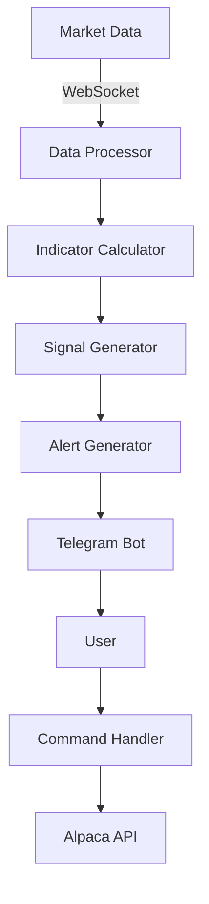

# Blackprint Trading Bot - Architecture Overview

## System Architecture

### 1. Core Components

#### 1.1 Market Analysis
- **Market Phase Detector**
  - Analyzes EMA relationships
  - Identifies market phases (Unordered, Emerging, Trending)
  - Monitors phase transitions

- **Technical Indicators**
  - Multiple EMAs (5,7,9,11,13,34,89)
  - Parabolic SAR
  - MACD
  - Real-time calculations

- **Signal Generator**
  - Entry/exit signal detection
  - Pullback identification
  - Trend confirmation

#### 1.2 Risk Management
- Position sizing calculations
- Stop-loss management
- Maximum position limits
- Risk per trade validation

### 2. Telegram Bot Integration

#### 2.1 Command System
```
/start          - Introduction and setup
/watch <ticker> - Start monitoring a ticker
/unwatch        - Stop monitoring
/setkey         - Set Alpaca API key
/trade          - Execute trades
/status         - View current positions
/help           - Command list
```

#### 2.2 Notification System
- Market phase updates
- Entry/exit signals
- Options recommendations
- Risk management advice

### 3. Data Flow



### 4. Storage System

#### 4.1 User Data
- Telegram chat IDs
- Watched tickers
- Preferences
- API keys (encrypted)

#### 4.2 Market Data
- Real-time price data
- Indicator calculations
- Signal history

### 5. Security Measures

#### 5.1 API Key Management
- Encrypted storage
- Secure transmission
- Access control

#### 5.2 Rate Limiting
- API request limits
- Command throttling
- Error handling

## Implementation Details

### 1. Technology Stack
- Python 3.11+
- python-telegram-bot
- alpaca-trade-api
- pandas/numpy
- Docker

### 2. Dependencies
```python
# Core dependencies
alpaca-trade-api>=3.0.0
python-telegram-bot>=20.0
pandas>=1.5.0
numpy>=1.21.0
ta>=0.10.0

# Development dependencies
pytest>=7.0.0
python-dotenv>=0.19.0
```

### 3. Configuration
```python
# Environment variables
TELEGRAM_BOT_TOKEN=
ALPACA_API_KEY=
ALPACA_SECRET_KEY=
ALPACA_BASE_URL=
```

### 4. Deployment
- Docker container
- Volume mounts for persistence
- Health monitoring
- Automatic restarts
