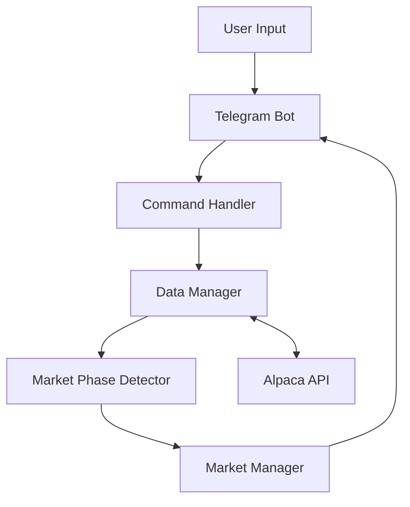

# Blackprint Trading Bot Architecture

## Overview

Blackprint is a market phase detection and trading bot built with Python, using asynchronous programming for real-time market data processing and Telegram for user interaction.

## Core Components

### 1. Telegram Bot Interface (`bot/telegram_bot.py`)
- Handles user commands and interactions
- Manages command parsing and response formatting
- Implements asynchronous message handling
- Provides real-time market updates
- Features:
  - Free-form symbol input
  - Customizable candle lengths
  - Historical analysis visualization
  - Real-time phase notifications

### 2. Market Phase Detector (`bot/market_phases.py`)
- Implements market phase detection algorithm
- Analyzes price action and momentum
- Calculates technical indicators
- Phases:
  - TRENDING: Strong directional movement
  - EMERGING: Early trend development
  - PULLBACK: Temporary price retracement
  - UNORDERED: No clear direction

### 3. Data Manager (`bot/data_manager.py`)
- Manages Alpaca API integration
- Handles real-time data streaming
- Processes historical data requests
- Features:
  - Configurable timeframes
  - Data caching
  - Error handling
  - Rate limit management

### 4. Market Manager (`bot/market_manager.py`)
- Coordinates market analysis
- Manages market state
- Handles phase transitions
- Provides formatted analysis results

## Data Flow

## Asynchronous Architecture

- Uses Python's `asyncio` for concurrent operations
- Implements event-driven data processing
- Manages multiple data streams efficiently
- Handles real-time updates without blocking

## Error Handling

1. Data Validation
   - Symbol verification
   - Data availability checks
   - Format validation

2. API Error Handling
   - Rate limit management
   - Connection retry logic
   - Timeout handling

3. User Input Validation
   - Command format checking
   - Parameter validation
   - Safe type conversion

## Configuration Management

1. Environment Variables
   - API credentials
   - Bot settings
   - Market parameters

2. Runtime Configuration
   - Candle length
   - Reference index
   - Analysis parameters

## Deployment

1. Docker Container
   - Python 3.11 base image
   - Dependency management
   - Environment isolation

2. Docker Compose
   - Service orchestration
   - Environment configuration
   - Volume management

## Monitoring and Logging

1. Application Logs
   - Command execution
   - Error tracking
   - Performance metrics

2. Market Data Logs
   - Phase transitions
   - Price updates
   - Analysis results

## Security

1. API Security
   - Secure credential storage
   - API key rotation
   - Rate limit compliance

2. User Authentication
   - Telegram bot token
   - User session management
   - Command access control

## Future Enhancements

1. Technical
   - Machine learning integration
   - Advanced indicator support
   - Performance optimization

2. Features
   - Portfolio management
   - Risk analysis
   - Backtesting capabilities

3. Infrastructure
   - Scaling capabilities
   - Multi-market support
   - Enhanced monitoring
